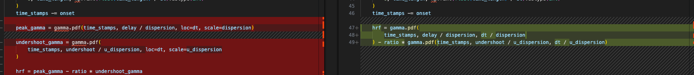

# Comparing hrf functions

---

# `_gamma_difference_hrf()`

## Important change: Looks like a change occurred in Nilearn to fix a bug and we should fix it too, even though it doesn’t seem to impact things when the defaults are used. Details here: [https://github.com/nilearn/nilearn/commit/e7a8bf5fce937088f71aa6993743a938fa0f17f4](https://github.com/nilearn/nilearn/commit/e7a8bf5fce937088f71aa6993743a938fa0f17f4)

**Where the code looks different (left = `nilearn`, right= `pybids`)**



- You can see that the usage of `gamma.pdf` is different between nilearn and pybids.  The two are not necessarily equivalent (code to test and output below).  Note, I’m only testing the `peak_gamma`  here, but the `undershoot_gamma` behaves similarly (matches with default settings, but can differ).

```python
import matplotlib.pyplot as plt
import numpy as np
from scipy.stats import gamma

# Parameters (example values similar to your function)
delay = 6
dispersion = 5
dt = 0.1  # example dt, could be tr / oversampling

shape = delay / dispersion

# x-axis: time points
time_stamps = np.linspace(0, 32, 320)

# Version 1: positional args (loc=dt/dispersion, scale=1)
pdf_pybids = gamma.pdf(time_stamps, delay / dispersion, loc=dt, scale=dispersion)

# Version 2: keyword args (loc=dt, scale=dispersion)
pdf_nilearn = gamma.pdf(time_stamps, delay / dispersion, dt / dispersion)

plt.figure(figsize=(10, 6))
plt.plot(
    time_stamps,
    pdf_pybids,
    label='pybids: time_stamps, delay / dispersion, loc=dt, scale=dispersion',
)
plt.plot(
    time_stamps,
    pdf_nilearn,
    label='nilearn: time_stamps, delay / dispersion, dt / dispersion',
    linestyle='--',
)
plt.title(
    f'Comparison of scipy.stats.gamma.pdf parameterizations, dt={dt}, delay={delay}, dispersion={dispersion}'
)
plt.xlabel('Time')
plt.ylabel('Probability Density')
plt.legend()
plt.show()
```


---

# `_hrf_kernel`

## WIP (asking for feedback about the failure behavior because the code looks like it is mostly the same)

**Code difference for FIR model shown below (nilearn is on left)**

**Not sure if this is important (I mean, it probably is since Nilearn added it)**


**Essentially, the `fir` options are about the same.  The lack of `/oversampling` in the `pybids` code shouldn’t have prevented a design matrix from getting formed.  The regressors would have just beens scaled differently.  Otherwise, I think the remaining `elif` are for `hrf` functions users input?  I’m just guessing.**  


---

# `_orthogonalize`

## Simply named as a private function in pybids (nilearn just calls it `orthgonalize` Otherwise, the same.


---

# `_regressor_names`

### Code is different, but has the same functionality for the most part, but `nilearn` has extras code.  In the beginning it has the `check_params(locals())` again and the end has a bunch of `elif` statments that pybids doesn’t have (I didn’t read the code closely enough to figure out what it did)


---

# `_resample_regressor`

### The same.  Different variable names are used, but it doesn’t impact the behavior.

---

# `_sample_condition`

### Code differs, but functionality appears to be the same.

I checked and `_compute_n_frames_high_res` (left, which is `nilearn`) matches the code on the right (`pybids`)


`nilearn` has an extra bit here, but I’m not sure it matters:


---

# `compute_regressor`

## TR is calculated differently, `fir_delays` change to `int()` code is missing in `pybids`

**TR calculation.  I’m just guessing `nilearn` added a fix for data that doesn’t have the same TR between all frames (I didn’t check the change history, that’s just what it looks like)**

- nilearn: `float(np.min(np.diff(frame_times)))`
- pybids: `tr = float(frame_times.max()) / (np.size(frame_times) - 1)`

**`fir_delays` has this in `nilearn`, but there isn’t an equivalent in `pybids` ,**


`nilearn` has some extra code for when `hrf_model='fir'` the oversampling > 1 (I don’t see how that would have caused our FIR issue and am guessing this was a bug that was being fixed?)


---

# `glover_dispersion_derivative`

## There is a potentially important difference (a variable called `ratio` is set differently)

**The code looks really different, but `nilearn` (left) is using a function that is essentially doing what `pybids` is doing *except* the `ratio=.35` is actually set to `.48` in nilearn.  I’m just assuming this is an important change, but I have no idea.**  


---

# `glover_hrf`

## It again appears the `ratio` setting has been changed in `nilearn` .  Likely important

left = `nilearn` , right= `pybids`


---

# `glover_time_derivative`

## Code looks different, but looks like it functions the same

---

# `spm_dispersion_derivative`

## Code looks different, but probably functions the same

---

# `spm_hrf`

## The same

---

# `spm_time_derivative`

## Looks different, but I think it works the same

